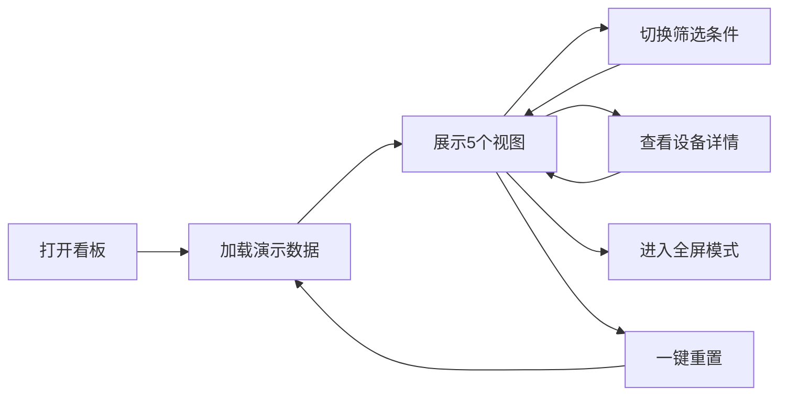

## 1. 产品概述

企业资产维保大屏看板，用于会议室大屏实时展示企业设备维护状态，为运维管理人员提供直观的资产运行全景视图。

- 主要解决企业资产运维数据分散、状态不透明、维保进度难追踪的问题
- 目标用户：运维管理人员、设施管理部门、企业决策者
- 产品价值：提升运维效率，降低设备故障率，优化维保成本

## 2. 核心功能

### 2.1 用户角色
| 角色 | 注册方式 | 核心权限 |
|------|----------|----------|
| 运维管理员 | 无需注册，纯前端应用 | 查看所有视图、切换筛选条件、导入数据、重置 |

### 2.2 功能模块
1. **总览视图**：核心指标卡片展示（资产总数、在用、待修、报废、超期维保）
2. **楼层地图视图**：按楼层点位展示设备分布与实时状态
3. **维保日程视图**：本周维保计划滚动展示，含负责人与完成进度
4. **故障排行视图**：高频故障资产排名、修复时长、供应商响应
5. **费用趋势视图**：维保费用趋势图表分析
6. **全局筛选**：部门切换、资产类别筛选、时间范围选择
7. **系统功能**：全屏模式、演示数据导入、一键重置

### 2.3 页面详情

| 页面名称 | 模块名称 | 功能描述 |
|----------|----------|----------|
| 总览视图 | 指标卡片 | 展示5项核心统计指标，含数值与同比变化 |
| 总览视图 | 状态分布饼图 | 资产状态占比可视化 |
| 楼层地图视图 | 楼层切换器 | 支持1-5层楼层切换 |
| 楼层地图视图 | 设备点位 | 空调、电梯、打印机等设备图标与状态标识 |
| 楼层地图视图 | 设备详情弹窗 | 点击点位查看设备详细信息 |
| 维保日程视图 | 日程列表 | 本周7天维保计划卡片 |
| 维保日程视图 | 进度条 | 每项维保任务完成进度可视化 |
| 维保日程视图 | 自动滚动 | 列表自动循环滚动展示 |
| 故障排行视图 | 排名列表 | Top 10高频故障资产排行 |
| 故障排行视图 | 修复时长柱状图 | 各资产平均修复时长对比 |
| 故障排行视图 | 供应商响应雷达图 | 多维度供应商响应能力评估 |
| 费用趋势视图 | 折线图 | 近12个月维保费用趋势 |
| 费用趋势视图 | 费用分类堆叠图 | 按类别堆叠展示费用构成 |
| 全局筛选 | 部门选择 | 下拉选择不同部门 |
| 全局筛选 | 资产类别 | 多选筛选资产类型 |
| 全局筛选 | 时间范围 | 快捷选择近7天/30天/90天/全年 |
| 系统功能 | 全屏模式 | 一键切换全屏展示 |
| 系统功能 | 导入演示数据 | 加载预设模拟数据 |
| 系统功能 | 一键重置 | 恢复初始状态 |

## 3. 核心流程

用户打开看板 → 自动加载演示数据 → 查看5个视图 → 切换筛选条件（部门/类别/时间） → 点击楼层设备查看详情 → 可进入全屏模式 → 可重置恢复初始状态

## 4. 用户界面设计

### 4.1 设计风格
- **主色调**：深空蓝 `#0a1628` 作为背景，营造科技感大屏氛围
- **辅助色**：青色 `#00d4ff` 作为主强调色，橙色 `#ff7a45` 用于告警状态
- **状态色**：绿色 `#00c48c` 正常，红色 `#ff4d4f` 故障，黄色 `#faad14` 待修，灰色 `#8c8c8c` 报废
- **字体**：采用 `Orbitron` 作为数字展示字体，`Noto Sans SC` 作为中文正文字体
- **卡片样式**：半透明玻璃拟态效果，渐变边框，细微发光效果
- **布局**：网格化布局，信息密度适中，适配1920x1080大屏
- **图标风格**：线性图标配合状态色彩填充

### 4.2 页面设计概述

| 页面名称 | 模块名称 | UI 元素 |
|----------|----------|---------|
| 总览视图 | 指标卡片 | 渐变背景、发光数字、趋势箭头、动画计数 |
| 楼层地图视图 | 楼层平面图 | SVG楼层轮廓、设备点位图标、状态光晕、悬停效果 |
| 维保日程视图 | 日程卡片 | 时间轴布局、进度条动画、头像标识 |
| 故障排行视图 | 排行榜 | 排名徽章、进度条、图表联动高亮 |
| 费用趋势视图 | 图表 | 渐变面积图、数据点发光、数值标签 |
| 顶部导航 | 筛选器 | 下拉菜单、标签切换、功能按钮 |

### 4.3 响应式
- **桌面优先**：以1920x1080会议室大屏为主要设计目标
- **自适应**：支持1280x720以上分辨率自适应缩放
- **全屏优化**：进入全屏模式时自动调整布局，隐藏非必要元素

### 4.4 动效设计
- 页面加载：元素淡入 + 向上滑动，错落有致的延迟动画
- 数字滚动：核心指标数值从0递增到目标值
- 设备状态：故障设备脉冲呼吸动画，超期设备闪烁提醒
- 图表动画：数据曲线从左到右绘制，柱状图从下往上生长
- 悬停反馈：卡片上浮、阴影加深、边框发光
- 视图切换：平滑过渡动画，内容淡入淡出
