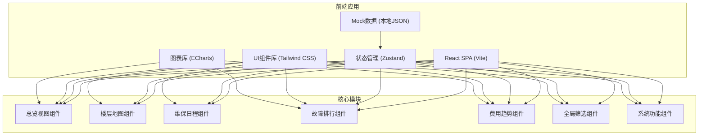

## 1. 架构设计



## 2. 技术描述

- **前端框架**: React 18 + TypeScript 5
- **构建工具**: Vite 5
- **样式方案**: Tailwind CSS 3 + CSS 变量
- **状态管理**: Zustand（轻量状态管理）
- **图表可视化**: ECharts 5
- **图标库**: Lucide React
- **数据方案**: 本地Mock数据，无需后端
- **动画方案**: Framer Motion（复杂动效）+ CSS Transitions

## 3. 路由定义

本项目为单页应用，采用组件化视图切换，无路由切换需求。

| 视图 | 组件路径 | 说明 |
|------|----------|------|
| 总览 | /components/Overview/Overview.tsx | 核心指标与状态分布 |
| 楼层地图 | /components/FloorMap/FloorMap.tsx | 楼层设备点位展示 |
| 维保日程 | /components/Schedule/Schedule.tsx | 本周维保计划 |
| 故障排行 | /components/FaultRanking/FaultRanking.tsx | 高频故障分析 |
| 费用趋势 | /components/CostTrend/CostTrend.tsx | 费用趋势分析 |

## 4. 数据模型

### 4.1 资产状态统计
```typescript
interface AssetStats {
  total: number;        // 资产总数
  inUse: number;        // 在用数量
  pendingRepair: number; // 待修数量
  scrapped: number;     // 报废数量
  overdue: number;      // 超期维保数量
}
```

### 4.2 设备信息
```typescript
interface Device {
  id: string;
  name: string;
  type: 'air_conditioner' | 'elevator' | 'printer' | 'projector' | 'other';
  floor: number;
  position: { x: number; y: number };
  status: 'normal' | 'fault' | 'pending' | 'scrapped';
  lastMaintenance: string;
  nextMaintenance: string;
  department: string;
}
```

### 4.3 维保任务
```typescript
interface MaintenanceTask {
  id: string;
  date: string;
  deviceName: string;
  type: string;
  assignee: string;
  progress: number;
  status: 'pending' | 'in_progress' | 'completed';
}
```

### 4.4 故障记录
```typescript
interface FaultRecord {
  id: string;
  deviceName: string;
  faultCount: number;
  avgRepairTime: number;  // 小时
  lastFault: string;
  supplier: string;
}
```

### 4.5 费用记录
```typescript
interface CostRecord {
  month: string;
  total: number;
  breakdown: {
    parts: number;
    labor: number;
    outsourcing: number;
  };
}
```

### 4.6 筛选条件
```typescript
interface Filters {
  department: string;
  assetTypes: string[];
  timeRange: '7d' | '30d' | '90d' | 'year';
}
```

## 5. 项目目录结构

```
src/
├── components/
│   ├── Overview/           # 总览视图
│   │   ├── Overview.tsx
│   │   ├── StatCard.tsx
│   │   └── StatusPieChart.tsx
│   ├── FloorMap/           # 楼层地图
│   │   ├── FloorMap.tsx
│   │   ├── FloorSelector.tsx
│   │   ├── DevicePoint.tsx
│   │   └── DeviceModal.tsx
│   ├── Schedule/           # 维保日程
│   │   ├── Schedule.tsx
│   │   ├── ScheduleCard.tsx
│   │   └── AutoScrollList.tsx
│   ├── FaultRanking/       # 故障排行
│   │   ├── FaultRanking.tsx
│   │   ├── RankingList.tsx
│   │   └── SupplierRadar.tsx
│   ├── CostTrend/          # 费用趋势
│   │   ├── CostTrend.tsx
│   │   ├── TrendLineChart.tsx
│   │   └── CostStackChart.tsx
│   ├── Layout/             # 布局组件
│   │   ├── Header.tsx
│   │   └── ViewTabs.tsx
│   └── common/             # 通用组件
│       ├── FilterBar.tsx
│       ├── FullscreenButton.tsx
│       ├── DataImportButton.tsx
│       └── ResetButton.tsx
├── store/
│   └── useAssetStore.ts    # Zustand状态管理
├── data/
│   └── mockData.ts         # Mock数据
├── types/
│   └── index.ts            # TypeScript类型定义
├── hooks/
│   ├── useCountUp.ts       # 数字滚动动画
│   ├── useFullscreen.ts    # 全屏模式
│   └── useAutoScroll.ts    # 自动滚动
├── utils/
│   └── helpers.ts          # 工具函数
├── App.tsx
├── main.tsx
└── index.css               # 全局样式 + Tailwind
```
